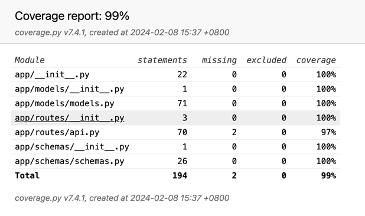

## 1 Application Functionality

In this project, we developed a comprehensive Flask data application, leveraging the power of Flask-SQLAlchemy for database interactions and utilizing SQLite for data persistence. Our application is designed with a focus on robust data management and API functionality. Below are the key features implemented in this project:

### 1.1 Database Interaction and Data Persistence

* Flask-SQLAlchemy Integration: We integrated Flask-SQLAlchemy to manage the database interactions in our application. This integration allows us to define the database models as Python classes and interact with the database using high-level Python objects. We have 6 different models for each data type, using abstract base classes to define common fields and methods.

* SQLite Database: We utilized SQLite as the database management system for our application. We leveraged the power of SQLite to store and manage the application data, ensuring data integrity and consistency.

### 1.2 API Functionality

* REST API Design: We designed a REST API to expose the application functionality to external clients. This API provides a completed set of endpoints to perform CRUD (Create, Read, Update, Delete) operations on the application data.
    We use blueprints and generate the API routes to provide a modular and organized structure for the API functionality. This approach allows us to manage the API endpoints efficiently and maintain a clean and structured codebase.
* HTTP Methods: We implemented 5 APIs based on 4 HTTP methods for each data model, for a total of 20 APIs. Among them, the GET method also provides query parameters.
* Error Handling: We implemented error handling for the API endpoints to provide meaningful error messages and status codes in case of invalid requests or server errors.

### 1.3 Testing

* Pytest-based unit testing with correct, boundary and error cases.
* Test coverage of 99% for all models and API endpoints.
* Parameterised tests for testing multiple cases with the same test logic, reducing code duplication and improving maintainability. 66 tests in total.

## 2 Tools and Techniques

* Flask-SQLAlchemy for database management.
  * Flask-marshmallow for serialization and deserialization of data.
* SQLite for data persistence.
* Pandas for reading data from CSV files.
* Poetry for dependency management.
* Pytest for unit testing.
  * Pytest-cov for test coverage.
  * Faker for generating fake data for testing.
  * Flask-testing for testing Flask applications.
* PyLint for code quality checks.
* Git and GitHub for version control.
* GitHub Actions for continuous integration.

## 3 Testing

We have implemented a comprehensive testing strategy to ensure the correctness and robustness of our application. Our testing strategy includes the following components:

* Unit Testing: We have implemented extensive unit tests for all the database models and API endpoints. These unit tests cover the correct, boundary, and error cases to ensure that the application behaves as expected in all scenarios.
* Test Coverage: We have achieved a test coverage of 99% for all the models and API endpoints. This high test coverage ensures that the majority of the code is exercised by the unit tests, reducing the likelihood of undetected bugs.
* Parameterised Tests: We have used parameterised tests to test multiple cases with the same test logic, reducing code duplication and improving maintainability. This approach allows us to test different scenarios with minimal additional code.
* Continuous Integration: We have set up GitHub Actions for continuous integration, which automatically runs the unit tests and checks the code quality on every push to the repository. This ensures that the codebase is always in a working state and meets the defined quality standards.
* Test Data Generation: We have used the Faker library to generate fake data for testing the application. This approach allows us to test the application with a variety of data scenarios, ensuring that the application can handle different data inputs effectively.

